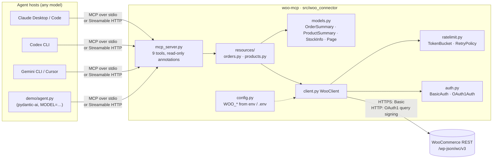
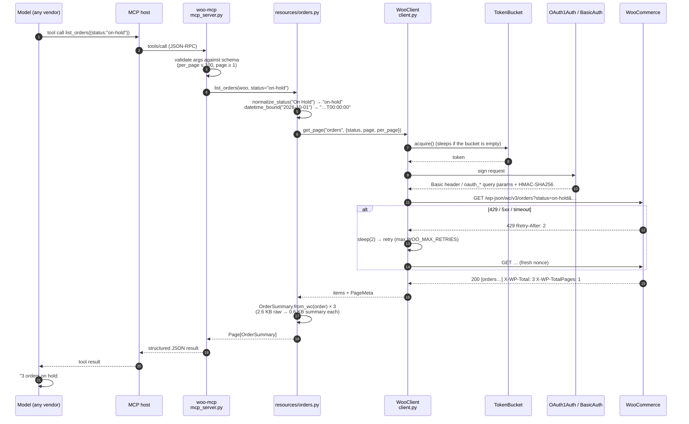
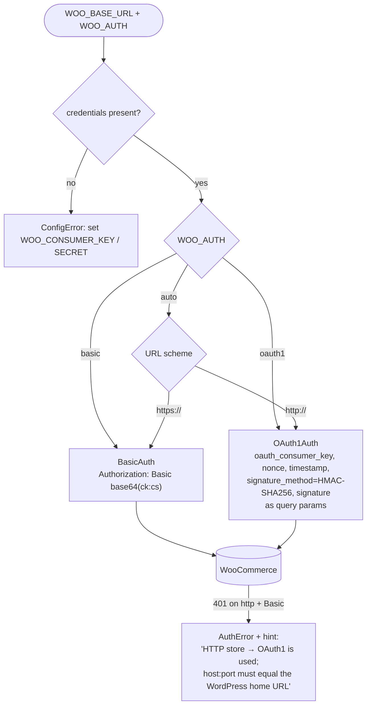
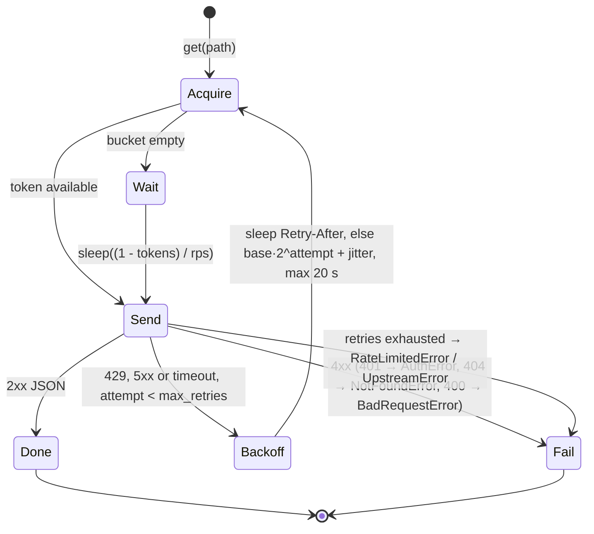

# woo-connector — WooCommerce → any AI agent, read-only

> **The merchant problem.** A store's support lead answers *"where is my order?"*, *"is this in stock?"*,
> *"how many orders are waiting on bank transfer?"* dozens of times a day, by logging into wp-admin.
> This connector lets an AI agent answer those questions **from the store's own data, read-only, inside
> whatever agent host the merchant already uses** — Agent Studio, Claude, Codex, Gemini CLI, Cursor, or a script.

A private connector built for the Razorpay Forward-Deployed Engineer (Agent Studio) assignment, option 3.

- **Nine read-only MCP tools**: list / get / search for orders and products, stock lookup, low-stock scan, status totals
- **Real WooCommerce auth**: HTTP Basic on HTTPS stores, OAuth 1.0a HMAC-SHA256 signing on HTTP stores — both verified against a live WooCommerce 11.2
- **Rate-limit handling**: client-side token bucket + `Retry-After`-aware exponential back-off, because merchant hosting throttles and PHP workers are scarce
- **Reproducible in five minutes**: a Docker store with fictional data, no accounts needed
- **Model-agnostic**: the server speaks MCP over stdio or Streamable HTTP; the demo script switches provider with one env var (Groq, Anthropic, OpenAI, Gemini, Mistral, Bedrock, …)

Read [CAPABILITIES.md](CAPABILITIES.md) for what the agent can and cannot do, assumptions, limitations and the production path.

---

## Contents

1. [How it works](#how-it-works) — architecture, one tool call end-to-end, auth selection, retries
2. [Step-by-step guide](#step-by-step-guide) — from zero to an agent answering questions
3. [Plug it into your agent host](#plug-it-into-your-agent-host)
4. [The tools](#the-tools)
5. [Authentication](#authentication) · [Rate limiting](#rate-limiting-and-retries) · [Real stores](#pointing-it-at-a-real-store)
6. [Tests](#tests) · [Layout](#layout) · [Rubric map](#rubric--where-to-look)

---

## How it works

### Architecture

The connector is layered so that nothing above the HTTP client knows about WooCommerce's auth or
rate limits, and nothing below the MCP server knows about MCP. The same primitives serve the MCP tools,
the smoke script and the tests; a second merchant tool (Unicommerce, Zoho) would add a sibling under
`resources/` and reuse everything else.



### One tool call, end to end

What happens when a model asks *"which orders are on hold?"* The numbers in brackets are where to look.



Errors take the same path in reverse: a 401 becomes `AuthError` with a hint naming the env vars and the
auth scheme in use; a 404 becomes `NotFoundError`; the MCP layer turns both into a tool error the model can
read and act on (`is_error: true`, message in `content`).

### Which auth scheme, and why

WooCommerce accepts the consumer key/secret in two ways and refuses the wrong one for the transport.
`select_auth()` in `auth.py` decides:



The OAuth1 base string WooCommerce verifies is
`METHOD & rawurlencode(scheme://host:port/path) & <params sorted, each "k=v" double-encoded, joined by %26>`,
signed with HMAC-SHA256 and key `consumer_secret + "&"`. The unit test pins this algorithm; the integration
test proves the live store accepts it and rejects a wrong secret.

### Throttle and retry



Defaults: `WOO_RPS=5`, `WOO_BURST=10`, `WOO_MAX_RETRIES=4`, `WOO_TIMEOUT=15`. Only GETs are issued, so
every retry is safe.

---

## Step-by-step guide

Prerequisites: Docker (Desktop or OrbStack), [`uv`](https://docs.astral.sh/uv/) (it fetches Python 3.12 itself).

### 1. Start the demo store

```bash
git clone https://github.com/hr7657316/private-woo-connector.git && cd private-woo-connector
docker compose -f docker/docker-compose.yml up -d
docker compose -f docker/docker-compose.yml logs -f seed     # Ctrl-C after "Success: seeded"  (~2-3 min first time)
```

You now have WordPress + WooCommerce at <http://localhost:8080> (wp-admin `admin` / `admin`) with a fictional
"Chai & Co." catalogue: 18 products (incl. a variable one, two out of stock, four low), 20 orders across every
status, 8 customers, and one **read-only** REST key. Re-running `up` is safe; the seed is idempotent.

### 2. Configure the connector

```bash
cp .env.example .env        # already contains the demo store's URL + read-only key
uv sync --all-extras
```

For a real store, edit `.env`: `WOO_BASE_URL`, `WOO_CONSUMER_KEY`, `WOO_CONSUMER_SECRET` (see [Pointing it at a real store](#pointing-it-at-a-real-store)).

### 3. Prove it works — no LLM needed

```bash
uv run pytest                 # 58 unit tests + 10 live tests against the Docker store
uv run scripts/smoke.py       # every tool, human-readable
```

Expected smoke output (abridged):

```
store      http://localhost:8080
auth       oauth1 (mode=auto)
OK    list_order_statuses  (41 ms)
      processing   6
      on-hold      3
      …
OK    list_orders(status=on-hold)  (35 ms)
      #46  on-hold  INR 1646.00  Kabir Singh     Direct bank transfer [KIT-FLK-500x1, COF-FLT-200x2]
      #44  on-hold  INR 3047.00  Meera Joshi     Direct bank transfer [GFT-CHAIx2]
      #42  on-hold  INR 1547.00  Sneha Kulkarni  Direct bank transfer [COF-ARB-500x2]
OK    get_stock(sku=CB-1L)  (30 ms)
      14   CB-1L   Cold Brew Coffee Concentrate 1L   qty=5 (instock)
OK    list_low_stock(threshold=5)  (121 ms)
      27   KIT-TMB-GRN  Tea Tumbler 350ml (Green)   qty=0 (outofstock)
      25   KIT-TMB-RED  Tea Tumbler 350ml (Red)     qty=1 (instock)
      …
all good
```

### 4. Ask an LLM — any vendor

Put a provider key in `.env` (git-ignored) or export it, pick a model, ask:

```bash
# .env
GROQ_API_KEY=gsk_…            # or ANTHROPIC_API_KEY / OPENAI_API_KEY / GOOGLE_API_KEY

MODEL=groq:openai/gpt-oss-120b   uv run --extra demo demo/agent.py "Which orders are on hold, and what is their combined total?"
MODEL=groq:qwen/qwen3.8-27b      uv run --extra demo demo/agent.py "Which orders are on hold, and what is their combined total?"
MODEL=anthropic:claude-opus-5    uv run --extra demo demo/agent.py "What is running low in stock?"
MODEL=openai:gpt-6.1-sol         uv run --extra demo demo/agent.py "Find Priya Nair's orders"
MODEL=google:gemini-3.8-flash    uv run --extra demo demo/agent.py "Is KIT-TMB-RED available?"
```

Model IDs verified against each vendor's model catalogue on 2026-10-08 (the format is `<pydantic-ai provider>:<vendor model id>`):

| Provider | Key env var | Current IDs (recommended → cheaper) | Source |
|---|---|---|---|
| Groq | `GROQ_API_KEY` | `openai/gpt-oss-120b`, `openai/gpt-oss-20b`, `qwen/qwen3.8-27b` | `GET https://api.groq.com/openai/v1/models` with your key |
| Anthropic | `ANTHROPIC_API_KEY` | `claude-opus-5`, `claude-sonnet-5`, `claude-haiku-4-5` | [Anthropic models overview](https://platform.claude.com/docs/en/about-claude/models/overview) |
| OpenAI | `OPENAI_API_KEY` | `gpt-6.1-sol` (recommended for tool use), `gpt-6-astra` (flagship), `gpt-6-luna` (small) | [OpenAI models](https://developers.openai.com/api/docs/models) |
| Google | `GOOGLE_API_KEY` | `gemini-3.8-flash` (stable), `gemini-3.1-pro-preview` | [Gemini models](https://ai.google.dev/gemini-api/docs/models) |

Model catalogues churn (Groq had already retired `llama-3.3-70b-versatile` by the time this was built), so if a run
fails with `model_not_found`, list the vendor's models and pick a current one - nothing in the connector changes.

[`demo/agent.py`](demo/agent.py) launches `woo-mcp` over stdio exactly like the desktop hosts do, hands the
tools to the model via pydantic-ai, and prints every tool call before the answer.

Recorded runs against the seeded store ([`demo/transcripts/`](demo/transcripts/)):

| Model (via Groq) | Question | Tool path | Correct? | Tokens |
|---|---|---|---|---|
| `openai/gpt-oss-120b` | on-hold orders + combined total | `list_order_statuses` → `list_orders(status=on-hold)` | ✅ 3 orders, ₹6,240.00 | 4.4k in / 0.3k out |
| `openai/gpt-oss-120b` | low stock ≤ 5 incl. variations | `list_low_stock(threshold=5)` | ✅ all 7 items, variations included | 2.8k / 0.4k |
| `openai/gpt-oss-120b` | Priya Nair's processing order + stock of its items | `search_orders("Priya Nair")` → `get_stock` ×2 | ✅ #45, TEA-DRJ-100 (3), KIT-KLD-6 (2) | 7.1k / 0.8k |
| `qwen/qwen3.8-27b` | on-hold orders + combined total | `list_order_statuses` → `list_orders(status=on-hold)` | ✅ total; ⚠️ its aside "₹6,191 in goods" is wrong (₹6,093) and it renamed one product | 7.7k / 0.3k |

Same server, same tools, two different model families — and the smaller model's slip is exactly the kind of
thing a production deployment needs an eval harness to catch (see CAPABILITIES.md).

### 5. Use it from your own agent host

See the next section. Then tear down with `docker compose -f docker/docker-compose.yml down -v`.

---

## Plug it into your agent host

The server command is `woo-mcp` (stdio). Every host gets the same nine tools; replace the path with your
clone's absolute path (`uv run --directory` makes the server read that repo's `.env`).

| Host | Config file | Snippet |
|---|---|---|
| Claude Desktop | `claude_desktop_config.json` | [`demo/hosts/claude_desktop.json`](demo/hosts/claude_desktop.json) |
| Claude Code | `claude mcp add …` | [`demo/hosts/claude_code.sh`](demo/hosts/claude_code.sh) |
| OpenAI Codex CLI | `~/.codex/config.toml` | [`demo/hosts/codex_config.toml`](demo/hosts/codex_config.toml) |
| Gemini CLI | `~/.gemini/settings.json` | [`demo/hosts/gemini_settings.json`](demo/hosts/gemini_settings.json) |
| Cursor | `.cursor/mcp.json` | [`demo/hosts/cursor_mcp.json`](demo/hosts/cursor_mcp.json) |
| Anything over HTTP | `uv run woo-mcp --transport streamable-http --port 8765` → `http://127.0.0.1:8765/mcp` | — |

Try: *"Which orders are on hold and what's their combined total?"* · *"What's below 5 in stock?"* ·
*"Find Priya Nair's orders"* · *"Is KIT-TMB-RED available?"*

---

## The tools

| Tool | Answers | Notes |
|---|---|---|
| `list_order_statuses` | "How many orders are pending / on hold / …?" | good first call: also lists the statuses that exist |
| `list_orders` | orders by status, date window, customer | newest first, paginated |
| `get_order` | one order in full | `verbose=true` returns the raw WooCommerce payload |
| `search_orders` | by order number, name, email, item name | WooCommerce `search` semantics |
| `list_products` | catalogue by status / stock status / category / type / SKU | |
| `get_product` | one product or variation | |
| `search_products` | by words in name, description, SKU | |
| `get_stock` | quantity + status for one product/variation, by id or SKU | |
| `list_low_stock` | tracked items at or below a threshold | client-side scan, lowest first |

Every tool is annotated `readOnlyHint: true`, `destructiveHint: false`. Responses are **trimmed summaries**
(a raw order is 2.5–4 KB; the ~0.6 KB summary keeps id, number, status, totals, customer, payment method,
city and line items). The full JSON contract is in [`tool_spec.json`](tool_spec.json).

---

## Authentication

WooCommerce issues a consumer key + secret per REST API key (*WooCommerce → Settings → Advanced → REST API*).
How they are sent depends on the transport, and the connector picks automatically (`WOO_AUTH=auto`):

| Store URL | Scheme | Why |
|---|---|---|
| `https://…` | HTTP Basic (`ck:cs`) | WooCommerce accepts Basic only over TLS |
| `http://…` | OAuth 1.0a, HMAC-SHA256, params in the query string | WooCommerce refuses Basic on plain HTTP; the Docker store exercises this path |

Gotcha: the OAuth1 signature covers `scheme://host:port/path`, so `WOO_BASE_URL` must equal the WordPress
home URL character for character (`localhost:8080`, not `127.0.0.1:8080`). The 401 hint says so.

The production onboarding flow (WooCommerce's `wc-auth` consent screen that issues keys via redirect) is
described in CAPABILITIES.md, not implemented.

## Rate limiting and retries

WooCommerce core has no rate limiter, but real stores sit behind WP Engine / Cloudflare / WAF rules and an
agent can burst dozens of calls. The client throttles itself (token bucket), honours `Retry-After`, backs
off with jitter otherwise, retries only idempotent GETs, and after the budget raises a typed error with a
hint instead of hanging. See the state diagram above.

## Pointing it at a real store

```bash
WOO_BASE_URL=https://shop.example.com
WOO_CONSUMER_KEY=ck_…          # permissions: Read is enough
WOO_CONSUMER_SECRET=cs_…
```

Nothing else changes. If the store is on plain HTTP, OAuth1 is used automatically.

## Tests

```bash
uv run pytest tests/unit          # 58 tests, no network: auth vectors, bucket timing, retry policy, error mapping, trimming, MCP schema
uv run pytest tests/integration   # 10 tests against the Docker store; auto-skipped if :8080 is down
```

The integration suite is where auth is *proven*, not mocked: the store accepts the OAuth1 signature,
rejects a wrong secret, and refuses Basic auth over HTTP.

## Layout

```
src/woo_connector/
  config.py      settings from env / .env (WOO_*)
  auth.py        BasicAuth, OAuth1Auth, select_auth()
  ratelimit.py   TokenBucket, RetryPolicy
  client.py      WooClient: throttle → auth → retry → typed errors; pagination helpers
  models.py      OrderSummary, ProductSummary, StockInfo, Page[T] (agent-sized views)
  resources/     orders.py, products.py — the primitives, independent of MCP
  mcp_server.py  the nine tools; `woo-mcp` entry point (stdio | streamable-http)
docker/          compose stack + idempotent seed (18 products, 20 orders, 8 customers, read-only key)
demo/            agent.py (any model) + host config snippets + transcripts
scripts/         smoke.py, export_tool_spec.py
tests/           unit/ (respx-mocked), integration/ (live store)
```

## Rubric → where to look

| Requirement | Where |
|---|---|
| Working OAuth or API-key auth flow | [`auth.py`](src/woo_connector/auth.py) (both), proven live in [`test_live_store.py`](tests/integration/test_live_store.py) |
| list / get / search primitives | [`resources/orders.py`](src/woo_connector/resources/orders.py), [`resources/products.py`](src/woo_connector/resources/products.py) |
| Rate-limit handling | [`ratelimit.py`](src/woo_connector/ratelimit.py), wired in [`client.py`](src/woo_connector/client.py) |
| MCP tool specification | [`tool_spec.json`](tool_spec.json) (generated), source in [`mcp_server.py`](src/woo_connector/mcp_server.py) |
| What the agent can / cannot do | [`CAPABILITIES.md`](CAPABILITIES.md) |
| Setup, run, assumptions, limitations | this file + `CAPABILITIES.md` |
| No real data / credentials | everything under `docker/seed/` is fictional; the only key in the repo is the demo store's read-only key |
